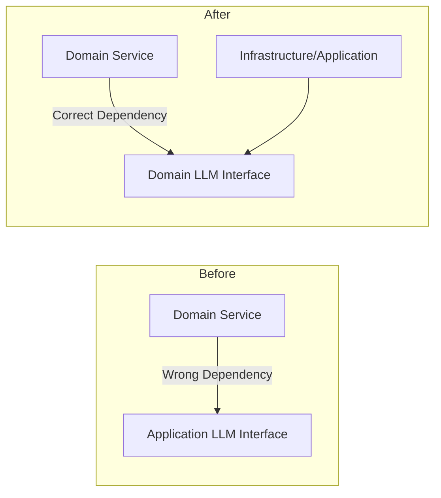

# Implementation Plan: Spec-074

## 📋 Branch Strategy
- `feature/074-llm-interface-compliance`

## 🛑 User Review Required
> [!IMPORTANT]
> - [ ] `LLMInterface`를 `app/application/interfaces`에서 `app/domain/interfaces`로 이동합니다. 이에 따라 프로젝트 전반의 임포트 경로가 대거 수정됩니다.

> [!WARNING]
> - [ ] 기존 `app/application/interfaces/llm.py`는 모든 변경이 완료된 후 시스템에서 완전히 제거됩니다.

## 🎯 Core Strategy
도메인 서비스(`IntentClassifier`, `QueryRewriter`)가 애플리케이션 계층에 의존하는 현상을 제거하기 위해, 추상 인터페이스를 도메인 계층으로 내재화합니다 (Dependency Inversion).

### Architecture Context


| Component | Strategy | Reasoning |
|:---:|:---|:---|
| **Domain Interface** | `app/domain/interfaces/llm_interface.py` 생성 | 도메인 독립성 및 아키텍처 규준 준수 |
| **Import Updates** | 전수 조사 및 수정 | 경로 변경으로 인한 런타임 오류 방지 |
| **Cleanup** | `app/application/interfaces/llm.py` 삭제 | 중복 코드 방지 및 아키텍처 정합성 유지 |

## 📂 Proposed Changes

### [Domain Layer]

#### [NEW] `app/domain/interfaces/llm_interface.py`
- `LLMInterface` 추상 클래스, `LLMResponse`, `LLMUsage` 정의 이동.

#### [MODIFY] `app/domain/services/intent_classifier.py`, `query_rewriter.py`
- 임포트 경로 수정: `app.application.interfaces.llm` -> `app.domain.interfaces.llm_interface`.

### [Application & Infrastructure Layer]

#### [MODIFY] `app/application/services/semantic_extractor.py`, `app/infrastructure/ai/ingestion_orchestrator.py` 등
- 모든 `LLMInterface` 참조 경로를 `app.domain.interfaces.llm_interface`로 업데이트.

#### [DELETE] `app/application/interfaces/llm.py`
- 모든 참조가 수정된 후 파일 삭제.

## 🧪 Verification Plan

### Automated Tests
```bash
# Unit Tests (Domain Services)
uv run pytest tests/unit/domain/services/test_intent_classifier.py
uv run pytest tests/unit/domain/services/test_query_rewriter.py

# Lint & Dependency Check
uv run ruff check app/domain
```

### Manual Verification
1. `grep -r "from app.application" app/domain` 실행 시 결과가 없어야 함.
2. `grep -r "app.application.interfaces.llm" .` 실행 시 결과가 없어야 함.
