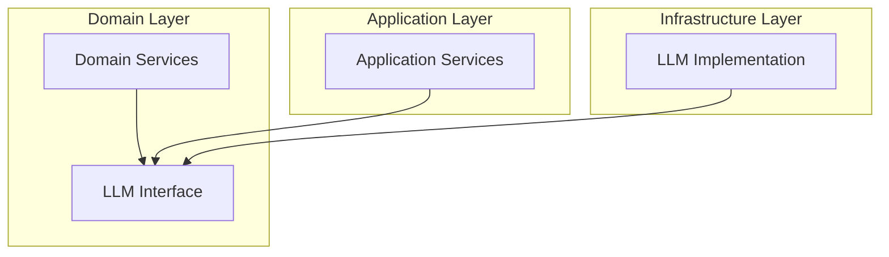

# Spec-074: LLMInterface Clean Architecture Compliance

## 📋 배경 및 문제 정의 (Background & Problem)

### 현재 상황
현재 `LLMInterface`는 `app/application/interfaces/llm.py`에 정의되어 있습니다. 이 인터페이스는 LLM 기능을 추상화하여 다양한 구현체(OpenAI, Claude 등)를 사용할 수 있게 합니다.

### 문제점
Clean Architecture의 **Dependency Rule**에 따르면, 상위 수준의 계층(Domain)은 하위 수준의 계층(Application, Infrastructure)에 의존해서는 안 됩니다. 하지만 현재 `IntentClassifier`와 `QueryRewriter` 같은 Domain Service들이 Application Layer에 있는 `LLMInterface`를 임포트하고 있어, 도메인 계층이 애플리케이션 계층에 의존하는 아키텍처 위반이 발생하고 있습니다.

### 해결 방안
`LLMInterface`와 관련 데이터 클래스들을 Domain Layer (`app/domain/interfaces/`)로 이동하여 의존성 방향을 올바르게 설정합니다. 이를 통해 도메인 로직이 외부 계층의 코드 변화에 영향을 받지 않도록 보호합니다.

## 📊 개념도 (Conceptual Architecture)

## 🎯 요구사항 (Requirements)

### Functional Requirements
1. `LLMInterface` 정의를 `app/domain/interfaces/llm_interface.py`로 이동.
2. `LLMResponse`, `LLMUsage` 등의 필수 데이터 구조를 도메인 계층으로 이동.
3. 프로젝트 내 모든 관련 임포트 경로 (`app.application.interfaces.llm` -> `app.domain.interfaces.llm_interface`) 수정.

### Non-Functional Requirements
1. **Dependency Rule**: `app/domain` 하위의 어떤 파일도 `app/application`을 임포트하지 않아야 함.
2. **Runtime Safety**: 경로 변경으로 인한 런타임 오류가 없어야 함.

## ✅ Definition of Done
1. 모든 단위 테스트 (`pytest`) 통과.
2. `ruff check`를 통한 의존성 및 정적 분석 오류 없음.
3. `LLMInterface`의 이동 및 참조 수정 완료.
4. `app/application/interfaces/llm.py` 파일 제거.
