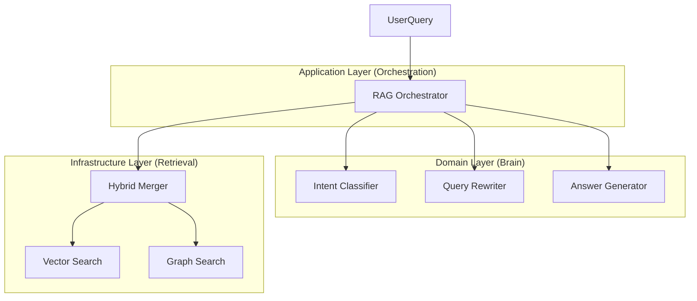

# Spec 075: RAG 3-Layer Code Structure Refactoring

## 📋 배경 및 문제 정의 (Background & Problem)

### 현재 상황
현재 RAG 시스템의 핵심 로직은 `app/infrastructure/ai/rag_nodes.py`라는 단일 파일(774행)에 모두 집중되어 있습니다. 이 파일 하나가 Brain(의도 분석), Orchestration(흐름 제어), Retrieval(검색 실행)의 모든 역할을 수행하고 있습니다.

### 문제점
1. **관심사의 분리 위반**: 비즈니스 로직(Domain), 애플리케이션 흐름(Application), 데이터 접근(Infrastructure)이 혼재되어 있어 유지보수가 어렵습니다.
2. **테스트 용이성 저하**: 모든 의존성이 `RAGNodes` 클래스 하나에 묶여 있어 개별 로직을 단위 테스트하기 어렵습니다.
3. **아키텍처 불일치**: 문서상으로는 3-Layer 아키텍처(Brain/Orchestration/Retrieval)를 표방하지만, 실제 코드는 이를 반영하지 못하고 있습니다. Spec 068 분석 결과, 이는 시스템 복잡도를 높이는 주원인으로 지목되었습니다.

### 해결 방안
`RAGNodes`의 기능을 3개 레이어로 분산하여 재배치합니다.
1. **Brain Layer**: 사용자 의도 파악, 쿼리 재작성, 답변 생성 로직 (Domain Layer)
2. **Retrieval Layer**: 벡터/키워드/그래프 검색 실행 및 결과 통합 (Infrastructure Layer)
3. **Orchestration Layer**: 각 단계를 연결하고 전체 흐름을 제어하는 LangGraph 노드 정의 (Application Layer)

## 📊 개념도 (Conceptual Architecture)

## 🎯 요구사항 (Requirements)

### Functional Requirements
1. `app/infrastructure/ai/rag_nodes.py` 파일 제거 및 기능을 각 레이어로 이관해야 합니다.
2. **Brain Layer (`app/domain/rag/brain/`)**:
   - `IntentClassifier`, `QueryRewriter` 등 순수 비즈니스 로직을 포함해야 합니다.
   - 외부 의존성 없이 독립적으로 테스트 가능해야 합니다.
3. **Retrieval Layer (`app/infrastructure/rag/retrieval/`)**:
   - `RetrieveHybrid`, `RerankResults` 등 실제 검색 및 리랭킹 수행 로직을 포함해야 합니다.
   - `Neo4j`, `ChromaDB` 등 구체적인 구현체에 의존합니다.
4. **Orchestration Layer (`app/application/rag/orchestration/`)**:
   - LangGraph의 노드 정의(`state` 입력받아 `state` 반환)를 담당합니다.
   - Domain 및 Infrastructure 서비스를 주입받아 실행합니다.

### Non-Functional Requirements
1. **Clean Architecture 준수**: 의존성 규칙(Dependency Rule) 위반이 없어야 합니다 (Source -> Domain <- Infrastructure).
2. **Testability**: 각 레이어별로 Mock을 활용한 단위 테스트가 가능해야 합니다.

## ✅ Definition of Done
1. `rag_nodes.py` 파일이 완전히 삭제되었습니다.
2. 모든 기존 기능(Intent Classification, Retrieval, Reranking, Answer Generation)이 정상 동작함을 E2E 테스트로 확인했습니다.
3. 새로운 구조의 Clean Architecture 준수 여부가 검증되었습니다 (의존성 위반 0건).
4. 각 레이어별 Unit Test Coverage 80% 이상을 달성했습니다.
