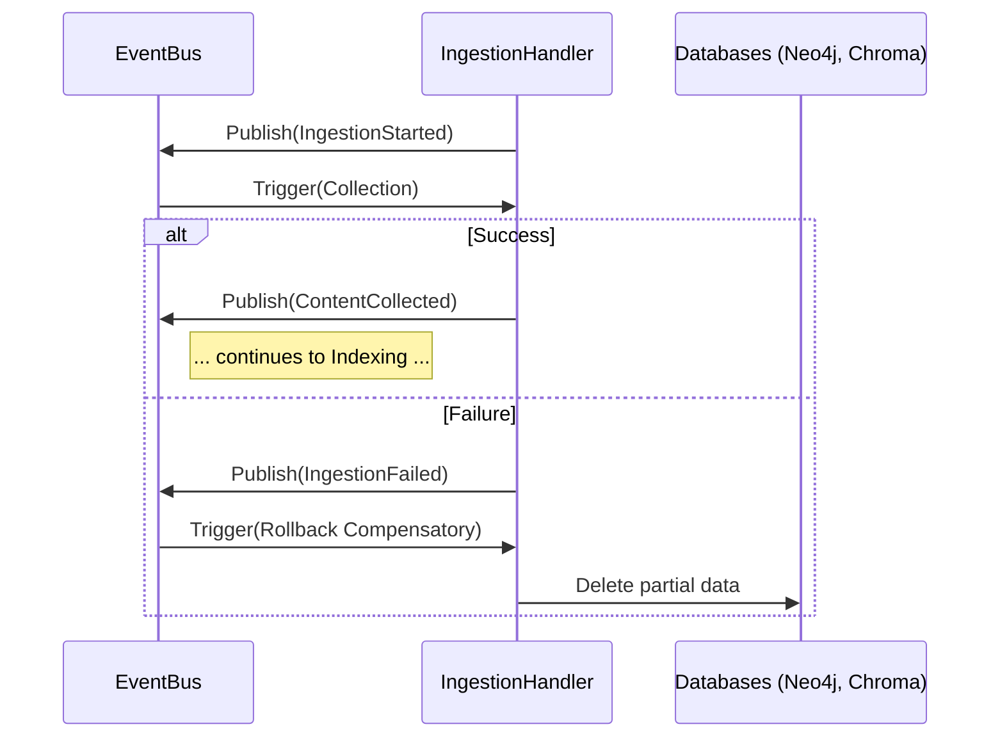

# Implementation Plan: Spec-076

## 📋 Branch Strategy
- `feature/076-ingestion-transaction-integrity`

## 🛑 User Review Required
> [!IMPORTANT]
> - **아키텍처 변경**: 기존의 동기적 서비스 호출 방식에서 비동기 이벤트 기반(Choreography)으로 전환됩니다. 이는 코드 복잡도를 다소 증가시킬 수 있으나, 시스템의 안정성을 획기적으로 향상시킵니다.
> - **인터페이스 수정**: `DocumentRepository` 인터페이스에 `delete(doc_id: str)` 메서드가 추가됩니다.

## 🎯 Core Strategy
내부 `EventBus`를 통해 수집 파이프라인의 각 구성 요소를 느슨하게 결합(Loose Coupling)하고, 각 서비스가 자신의 성공 여부를 책임지고 알리며, 실패 시 일관된 롤백 로직을 가동합니다.

### Architecture Context


| Component | Strategy | Reasoning |
|:---:|:---|:---|
| **EventBus** | Internal Asyncio Bus | 간결성 및 오버헤드 방지 |
| **Saga Type** | Choreography | 중앙 통제 없이 확장성 확보 |
| **Compensation**| Hard Delete | RAG 엔진의 데이터 무결성 최우선 |

## 📂 Proposed Changes

### [Core & Infrastructure]

#### [NEW] `app/core/events.py`
비동기 `EventBus` 싱글톤 구현. `subscribe`, `publish`, `_process_events` 메서드 지원.

#### [NEW] `app/domain/events/ingestion_events.py`
`IngestionStarted`, `DataIndexed`, `IngestionFailed` 등 각 단계별 Pydantic 기반 이벤트 정의.

#### [MODIFY] `app/domain/interfaces/document_repository.py`
`delete(doc_id: str)` 추상 메서드 추가.

#### [MODIFY] `app/infrastructure/repositories/composite.py`
`delete` 메서드 구현 (Neo4j 및 ChromaDB 연동).

### [Application & Saga]

#### [NEW] `app/application/saga/ingestion_handlers.py`
이벤트를 구독하고 실제 서비스를 트리거하며, 예외 발생 시 실패 이벤트를 던지는 핸들러 클래스들 구현.

#### [MODIFY] `app/application/services/ingestion.py`
이벤트 기반으로 진입점 리팩토링.

## 🧪 Verification Plan

### Automated Tests
```bash
# EventBus Unit Tests
uv run pytest tests/unit/core/test_events.py

# Rollback Integration Tests
uv run pytest tests/integration/test_ingestion_rollback.py
```

### Manual Verification
1. Admin UI에서 수집 요청.
2. Indexing 직전 코드를 모의로 중단시켜 Fail 유도.
3. Neo4j 및 ChromaDB 쿼리를 통해 데이터가 잔류하지 않음을 확인.
