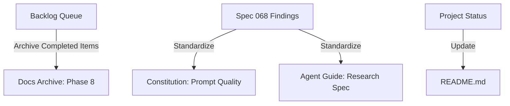

# Spec-077: Phase 8 Documentation & Archive

## 📋 배경 및 문제 정의 (Background & Problem)

### 현재 상황
Phase 8 (Architecture & Quality Foundation)의 모든 엔지니어링 작업이 완료되었습니다. 현재 백로그(`backlog/queue.md`)에는 완료된 Phase 8 항목들이 남아있으며, Phase 8을 통해 도출된 중요한 프로세스 변경 사항들(Prompt Quality Standard, Research Spec Definition)이 아직 `constitution.md`와 `agent.md`에 반영되지 않았습니다.

### 문제점
- **백로그 가독성 저하**: 완료된 Phase 8 항목들이 현재 활성 Queue에 섞여 있어 다음 Phase 계획 수립에 방해가 됩니다.
- **프로세스 표준 부재**: Prompt 품질 관리 및 Research Spec 진행에 대한 명시적인 기준이 문서화되지 않아, 향후 작업 시 일관성을 보장하기 어렵습니다.
- **프로젝트 현황 불일치**: `README.md` 등 주요 문서가 과거 상태(Phase 8 진행 중)를 가리키고 있습니다.

### 해결 방안
- **Phase 8 Archive**: `backlog/queue.md`의 완료 항목을 `docs/archive/phase_8_architecture_foundation.md`로 이동하여 보존합니다.
- **Constitution Update**: Prompt Quality Standard (20+ test cases, Versioning 등)를 헌법(Constitution) 레벨로 격상합니다.
- **Agent Guide Update**: Research Spec의 진행 방식과 완료 기준을 `agent.md`에 명시합니다.
- **README Renewal**: `README.md`를 "Knowledge Factory" 비전에 맞춰 전면 개편하고, 3-Layer Architecture를 시각화하며, 설치 가이드를 분리합니다.

## 📊 개념도 (Conceptual Architecture)

## 🎯 요구사항 (Requirements)

### Functional Requirements
1. `backlog/queue.md`에서 Phase 8 섹션이 제거되고, `docs/archive/phase_8_architecture_foundation.md`에 모든 내용이 보존되어야 한다.
2. `constitution.md`에 "Prompt Quality Standard" 섹션이 추가되어야 한다.
3. `agent.md`에 "Research Spec" 카테고리와 프로세스가 추가되어야 한다.
4. `README.md`가 "Knowledge Factory" 비전과 "3-Layer Architecture"를 명확히 전달하도록 전면 개편되어야 한다.
5. 설치 및 배포 가이드는 `docs/guides/getting_started.md`로 분리되어야 한다.

### Non-Functional Requirements
1. 마크다운 링크(Relative Link)가 깨지지 않고 정상 동작해야 한다.
2. 기존 문서의 스타일과 톤앤매너를 유지해야 한다.

## ✅ Definition of Done
1. `docs/archive/phase_8_architecture_foundation.md` 파일 생성 및 내용 검증 완료
2. `backlog/queue.md` 정리 완료
3. `constitution.md`, `agent.md`, `README.md` 업데이트 완료
4. 모든 문서의 링크 유효성 검증 완료
