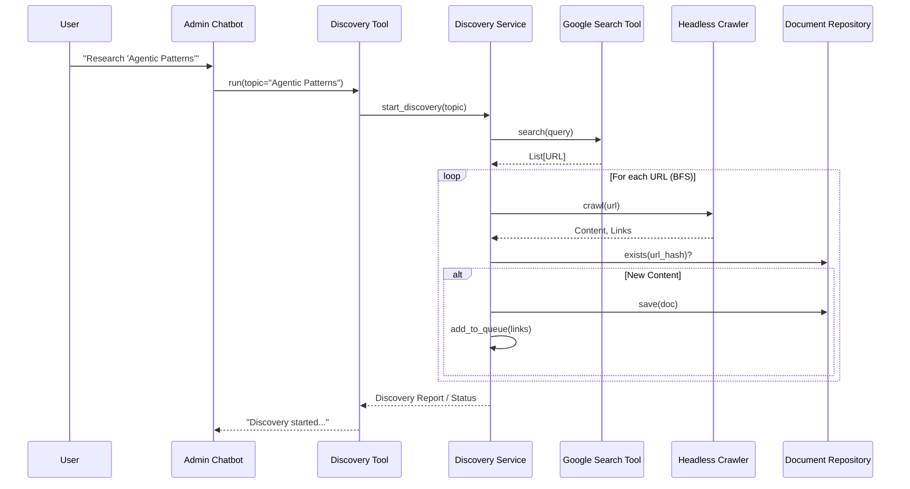

# Implementation Plan: Spec-078

## 📋 Branch Strategy
- `feat/spec-078-autonomous-discovery`

## 🛑 User Review Required
> [!IMPORTANT]
> - [ ] **Google API Key**: `GOOGLE_API_KEY`와 `GOOGLE_CSE_ID` (Custom Search Engine ID)가 `.env`에 설정되어 있어야 합니다. 배포 전 확인 필요.

## 🎯 Core Strategy

### Architecture Context


| Component | Strategy | Reasoning |
|:---:|:---|:---|
| **Google Search** | Custom Search JSON API | 가장 신뢰할 수 있고 구조화된 검색 결과 제공 (무료 할당량 고려 필요) |
| **Crawler** | Existing `SmartScraper` reuse | 기존에 구현된 Headless/Smart Scraper를 재사용하여 일관성 유지 |
| **Queue** | In-Memory (Initial) | 초기 구현 복잡도를 낮추기 위해 메모리 큐 사용 (추후 Redis 등으로 확장 가능) |

## 📂 Proposed Changes

### Infrastructure Layer

#### [NEW] `app/infrastructure/external_api/google_search_client.py`
- Google Custom Search API 클라이언트 구현
- `search(query: str, limit: int) -> List[str]`

#### [MODIFY] `app/bootstrap/di.py`
- `GoogleSearchClient` 의존성 주입 설정 추가

### Domain Layer

#### [NEW] `app/domain/services/discovery_service.py`
- 탐색 로직의 핵심 (BFS 탐색, 중복 체크, 도메인 필터링)
- `discover(topic: str, max_depth: int, max_docs: int)`

### Interface Layer (API & Tools)

#### [NEW] `app/interfaces/api/v1/discovery_routes.py`
- `POST /api/v1/discovery` 엔드포인트 구현

#### [NEW] `app/interfaces/tools/discovery_tool.py`
- LangGraph/LangChain 호환 Tool 구현 (`DiscoveryTool`)
- Chatbot이 호출할 수 있는 인터페이스 제공

## 🧪 Verification Plan

### Automated Tests
```bash
# Unit Tests (Google Search Mock)
uv run pytest tests/unit/infrastructure/test_google_search.py

# Integration Tests (Discovery Flow with Mock Search)
uv run pytest tests/integration/test_discovery_service.py
```

### Manual Verification
1. `.env`에 Google API Key 설정
2. Swagger UI (`/docs`) 접속
3. `POST /api/v1/discovery` 호출 (Topic: "LangChain Agents")
4. 로그(`uv run uvicorn ...`)를 통해 URL 방문 및 수집 과정 확인
5. Admin Dashboard에서 수집된 문서 확인
