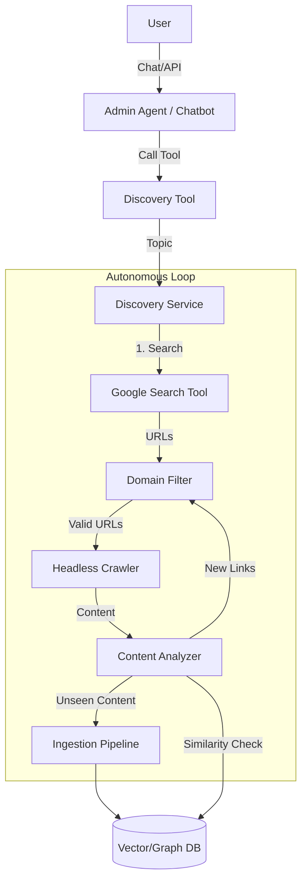

# Spec-078: [Agentic] Autonomous Discovery (Research Crawler)

## 📋 배경 및 문제 정의 (Background & Problem)

### 현재 상황
현재 시스템은 사용자가 명시적으로 제공한 URL(`POST /ingest/web`) 또는 업로드한 파일만 수집할 수 있습니다. 수동적(Passive)인 수집 방식에 의존하고 있어, 지식 베이스를 확장하려면 사용자가 지속적으로 소스를 찾아 입력해야 합니다.

### 문제점
1. **지식 확장의 한계**: 사용자가 모르는 소스는 수집되지 않아 지식의 사각지대가 발생합니다.
2. **비효율성**: 사용자가 일일이 Google 검색 후 URL을 복사/붙여넣기 해야 하는 번거로움이 있습니다.
3. **단편적 정보**: 특정 주제에 대해 깊이 있는 탐색(Recursive Crawling)이 어렵습니다.

### 해결 방안
주제(Topic)만 입력하면 에이전트가 스스로 **검색(Search) -> 탐색(Crawl) -> 평가(Evaluate) -> 수집(Ingest)** 사이클을 수행하는 **Autonomous Discovery Agent**를 도입합니다.
Google Custom Search API를 활용하여 초기 시드 URL을 확보하고, 재귀적으로 링크를 따라가며 유용한 정보를 수집합니다.

## 📊 개념도 (Conceptual Architecture)

## 🎯 요구사항 (Requirements)

### Functional Requirements
1. **Topic 기반 검색**: 사용자가 입력한 키워드로 Google 검색을 수행하여 시드 URL을 확보해야 합니다.
2. **LangGraph Tool Integration**: 
    - 내부 **Admin Agent** (LangGraph 기반)가 호출할 수 있는 Python Tool 형태로 구현합니다.
    - (Option) 추후 **MCP Server** (Spec 028)를 통해 외부(Cursor 등)로 노출할 수 있도록 구조를 잡습니다.
3. **재귀적 탐색 (Recursive Crawling)**: 수집된 페이지 내의 링크를 추출하여 설정된 깊이(Depth)만큼 추가 탐색해야 합니다.
4. **도메인 필터링 (Blocklist)**: 
    - "전체 웹"을 대상으로 검색하되, 신뢰할 수 없는 도메인(e.g., adult, spam)이나 불필요한 파일(PDF, 이미지)을 **제외(Block)**하는 방식으로 필터링합니다.
    - (Option) 필요 시 특정 도메인만 허용(Allowlist)하는 모드로도 전환 가능하도록 설계합니다.
5. **중복 수집 방지**: 이미 수집된 URL이나 내용이 유사한 페이지는 건너뛰어야 합니다.
6. **수집 제한 설정**: 무한 루프 방지를 위해 최대 수집 문서 수(Max Docs)와 깊이(Max Depth)를 제한해야 합니다.

### Non-Functional Requirements
1. **Politeness**: 동일 도메인에 대한 과도한 요청을 방지(Rate Limiting)해야 합니다.
2. **Resilience**: 개별 페이지 수집 실패가 전체 프로세스를 중단시키지 않아야 합니다.
3. **Observability**: 탐색 과정(방문한 URL, 수집된 수, 실패 원인)을 로그나 대시보드(또는 채팅 응답)에서 확인할 수 있어야 합니다.

## ✅ Definition of Done
1. `POST /discovery/start` API 및 `DiscoveryTool` 구현이 완료되어야 합니다.
2. Admin 챗봇(Spec 029) 등에서 자연어로 탐색 명령을 내릴 수 있어야 합니다(또는 최소한 도구 연동 준비 완료).
3. Google Custom Search API 연동이 완료되고, 검색 결과가 정상적으로 수집되어야 합니다.
4. 최소 1단계(Depth 1) 이상의 링크 추적 기능이 동작해야 합니다.
5. 이미 수집된 문서는 중복 수집되지 않아야 합니다.
6. `Spec 083` (Scenario Test) 연동 전, 기본적인 Integration Test가 통과해야 합니다.
